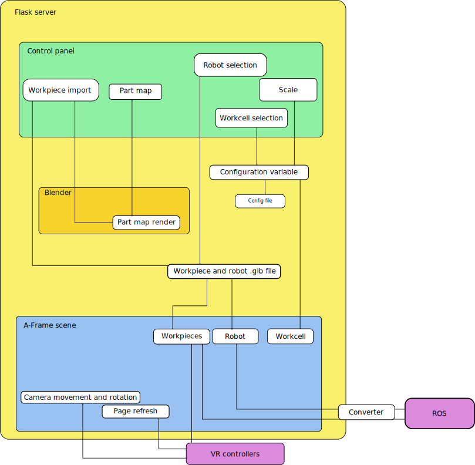

# **VR-RM-MT: Virtual reality set for robot and machine monitoring and training** 

## About VR-RM-MT

The main functionality of this component is to enable the training and support of human workers in collaborative tasks. For doing so, the main activities of the collaborative task and the interaction of worker and robot is created in Virtual Reality (VR). By using a virtual reality headset and equipment the worker can remotely visualize, monitor and perform the training of collaborative tasks with robots.  It should be noted that based on the use case requirements (e.g., workspace and environment, equipment, safety aspects and interfaces to other components), several data inputs might be needed for creation of custom simulations. The component is divided into a sandbox mode (using pre-programmed actions) and a dynamic mode, which depending on configuration could receive data inputs from ROS nodes for on-the-fly creation of tasks.

## Architecture
VR-RM-MT is a web application
that provides a virtual reality
(VR) environment, via WebXR,
in which a worker can practise
interacting with a collaborative
robot.
The application has two GUIs:
the control panel, in which the
environment is set up and the
actual VR scene, where the user
can interact with imported
workpieces and see the virtual
robot move and interact with the
pieces.

---

## Installation
### System requirements
- Client:
    - A VR headset supported by A-Frame and with controllers that have
six degrees of freedom (see here:
https://aframe.io/docs/1.2.0/introduction/vr-headsets-and-webvr-browsers.html)
    - A dedicated GPU compatible with the headset
    - Windows 10
- Server:
    - Docker
  
Note that the server and client don't have to be two separate computers, although this is possible

### Installation process
Simply clone the Docker Image as you would any other Docker image.

---

## Configuration
Run the container and enter 127.0.0.1:5000 on your browser to open the control panel.

In the control panel, there is a section titled "Workpiece upload". Select a local stl file with the model of the fully assembled item that should be assembled in the VR environment. Each piece of the item should be a separate part in the 3D model. After selecting the file, press "Upload". The page should reload shortly.

### Scripting
Please note that this section is only relevant __if you wish to run the application in sandbox mode.__

The scripting environment can be entered after uploading a workpiece assembly by clicking the "Write sandbos instructions" button in the top of the control panel. This scripting area will have a text area, in which the user can write the script as well as a __piece map,__ displaying an image of each piece with its automatically generated name.

Scripts are split into __actions,__ which are separated by lines with a single "@" character. An action represents a sequence of instructions for the robot to follow when the VR user presses the "next action" button on their controller.

A script can have the following commands, each on their own line:
- ``label <object name> <new object name>`` 
  - Allows giving a workpiece a new alias, which can be used in place of the automatically generated name.
  - Should generally be used in the beginning of the script.
- ``description <description message>``
  - Gives a description to the action this command is used inside of.
  - This description will be displayed in the monitor in the VR environment.
- ``join <object 1 name> <object 2 name>`` 
  - Attaches two workpieces to each other.
  - Going forward, the workpieces will move as one
- ``grab``
  - Closes the gripper.
  - Causes the robot to grab the workpiece in its current position.
- ``drop``
  - Opens the gripper
  - Causes the robot to drop the workpiece that it's currently holding.
- `rest <movement time>`
  - Causes the robot to move to a resting position
- `<x> <y> <z> <movement time>`
  - Causes the robot to move its head to the provided coordinates

---

## Working in the VR environment 
In the VR environment, the robot will move as instructed by the ROS publisher and the user can move using the left joystick to move around the environment and the right joystick to rotate. 

When the user brings one of their hands sufficiently close to a workpiece, the piece will be highlighted to indicate that it can be grabbed by the user by holding down the trigger button in the corresponding controller. When the user is holding an object in each of their hands, they can attach the objects to each other by bringing them close to each other and releasing one of the trigger buttons.